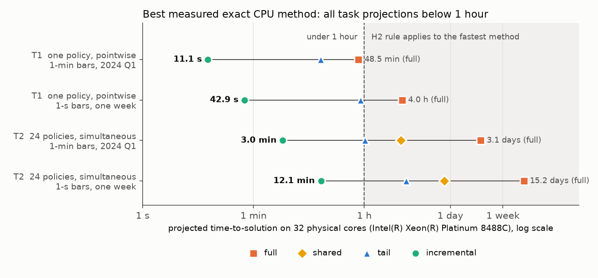

# surveillance-frontier

**How well can a surveillance policy be stress-tested within a fixed time budget, and how much does GPU parallelism
change that?** Evaluating a policy means re-running its detector over many scenarios; this project measures how far
and how finely that search can go on CPUs and GPUs, using market surveillance as the first domain.

[](LICENSE)


## Question

This project asks how policies for coordinated groups of accounts compare with policies for single accounts.
Whether such a policy holds up is a worst-case question: the largest effect it can miss over a stated set of
scenarios. Every scenario means re-running detection, so the answer is limited by how many evaluations fit into the
time available, and by whether those evaluations are done without waste.

**What is estimated so far.** Phase 1 defines a *conditional detection rate*: on one fixed series, the share
of positions at which a policy reports a new episode for a synthetic test event of given length and strength.
Sampling uncertainty is quantified by confidence intervals, and on small problems the rate can be computed exactly.
Phase 0 used the overlap rate, which also counts episodes already present on the unchanged series. A *worst-case undetected effect* also needs a
damage function, an admissible scenario set, and a bound direction (a maximum found by search is only a lower bound
on the worst case); these are defined before any bound is reported.

- **H1.** Under account-level policies the undetected effect grows with the number of accounts used; under
  group-level policies it is bounded. Compared at equal total alert budget, with oracle and estimated grouping
  reported separately and the cost of grouping inside the time budget.
- **H2.** For stress-testing tasks with a stated accuracy, even the fastest exact CPU method, not just a full
  re-run of the detector, needs more time than is available.
- **H3.** A GPU implementation with bit-identical results reaches the same accuracy in less time.
- **H4.** At equal wall-clock time, the GPU's estimate has a smaller error against an exact reference.

## Latest result — Phase 1

<p align="center"></p>

Phase 1 tested H2 on a 32-core CPU (AWS `c7i.16xlarge`) before building any GPU engine. Two tasks were fixed in
advance: one policy's detection-rate curve over 8 event lengths × 17 strengths (T1, 95% intervals with half-width ≤ 0.02 per point), and the same
for 24 policy settings with at least 95% simultaneous coverage over 3,264 intervals (T2). Task times were
projected from measured trial throughput for full, shared, tail, and incremental methods (shared was measured only
for multi-policy grids). Their exactness contract is checked against full recomputation on sampled trials.

- **Full recomputation is not the CPU's floor.** The incremental method runs 349x more trials per second than full
  recomputation at N = 604,800, K = 15, one policy and one thread. The differential gate found 0 mismatches
  across 2,112 real-data method–trial checks (704 each for shared, tail, and incremental).
- **H2 is not supported for these tasks.** The fastest exact method is projected to finish T1 in 43 s and T2 in
  12 minutes on the 1-second week, against a 1-hour decision line set before the run. With full recomputation the
  same T2 would have been read as a 15-day task.
- **The interval method holds against exact rates** computed by enumeration on a 64,000-bar prefix, and the exact
  detection rate is not always monotone in event strength.

The times are projections from q = 16 batch throughput and nearby measured event lengths, checked within 5% on
the trial loop of a smaller task. End-to-end task completion remains unverified (the frozen F4 claim). Phase 2
therefore compares a GPU against the incremental CPU, not against full recomputation. Under the rule set before the
run, the GPU comparison moves to larger tasks; which ones is still open, and each is fixed with its own criteria
before it is measured. Full write-up, limits, and the plan for Phase 2:
[Phase 1](docs/phase1.md).

## Phases

| Phase | Question | Status | Document |
|---|---|---|---|
| 0. Pilot | When does a GPU help an exhaustive window scan, where does the time go, and what does a time budget buy? | Done | [Phase 0 results](docs/phase0.md) |
| **1. Feasibility** | What does a stated stress-testing task cost with the fastest exact CPU method? | Done | [Phase 1 results](docs/phase1.md) |
| 2. GPU engine | What limits the exact computation on the machines at hand, does the matching resource help, and does a bit-identical GPU engine reach the same result sooner than the incremental CPU? | Designed, not started | [Protocol](experiments/phase2-gpu/README.md) |

## Repository layout

```text
engine/                          domain-agnostic C++/OpenMP detector engine: scan, ranking, selection, gate, benchmarks
cases/finance/                   market-data case: Binance kline download into engine series files
experiments/phase0-pilot/        pilot notebook (.py source + generated .ipynb) and results
experiments/phase1-feasibility/  scenario-space definition, sweep, projection and figure scripts, results
docs/                            phase write-ups (phase0.md, phase1.md), references (references.md), figures (assets/)
tools/                           notebook converter, GPU-free dry-run runner, CPU stand-in for CuPy (fakecupy)
```

## Quick start

**Engine (Phase 1).** Needs CMake ≥ 3.18 and a C++17 compiler with OpenMP:

```bash
cmake -S . -B build && cmake --build build -j && ./build/sf_test
```

Data download, the reproduction gate, and the CPU sweep are described in
[`experiments/phase1-feasibility/`](experiments/phase1-feasibility/README.md).

**Phase 0 pilot.** Open [`experiments/phase0-pilot/pilot.ipynb`](experiments/phase0-pilot/pilot.ipynb) in Google
Colab, select a **T4 GPU** runtime, and run all cells. To edit the notebook, change the `.py` source and regenerate:

```bash
python3 tools/py2nb.py experiments/phase0-pilot/pilot.py experiments/phase0-pilot/pilot.ipynb
```

## Scope and conduct

- Results so far are conditional detection rates and computational costs; damage bounds are future work. The repository does not provide procedures for evading
  any real surveillance system.
- Detectors here are research reimplementations, not copies of any exchange's or regulator's system.
- No real account is labeled as a manipulator; publicly reported incidents are used only to sanity-check detectors.
- Background, data sources, and related work: [docs/references.md](docs/references.md).

## Data and license

Code and documentation are released under the [MIT License](LICENSE).

Market data comes from the [Binance public data archive](https://data.binance.vision) and is downloaded at run
time; no raw market data is stored in this repository. Stored results contain only values derived from it (rarity
scores, detection indicators and rates, timings, summary statistics) and figures plotted from it, which remain subject to the data provider's terms.
