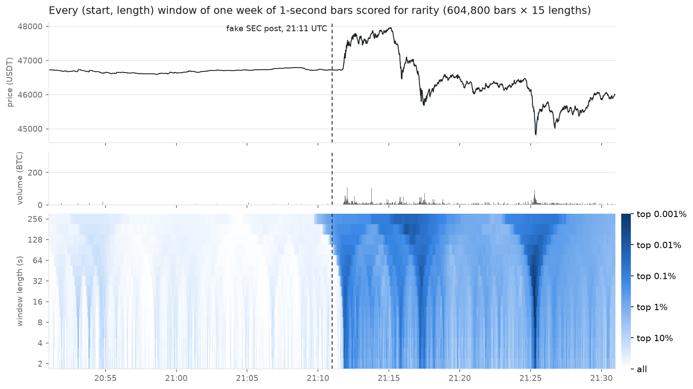

# surveillance-frontier

**How well can a surveillance policy be stress-tested within a fixed time budget, and how much does GPU parallelism
change that?** Evaluating a policy means re-running its detector over many scenarios; this project measures how far
and how finely that search can go on CPUs and GPUs, using market surveillance as the first domain.

[](LICENSE)


## Question

Surveillance increasingly judges behaviour by groups of accounts that act together rather than by single accounts.
Whether such a policy holds up is a worst-case question: the largest effect it can miss over a stated set of
scenarios. Every scenario means re-running detection, so the answer is limited by how many evaluations fit into the
time available, and by whether those evaluations are done without waste.

**What is estimated so far.** Phases 0 and 1 estimate a *conditional detection rate*: on one fixed series, the share
of positions at which a policy reports a new episode for a synthetic test event of given length and strength. Its
error is known, and on small problems it can be computed exactly. A *worst-case undetected effect* also needs a
damage function, an admissible scenario set, and a bound direction (a maximum found by search is only a lower bound
on the worst case); these are defined before any bound is reported.

- **H1.** Under account-level policies the undetected effect grows with the number of accounts used; under
  group-level policies it is bounded. Compared at equal total alert budget, with oracle and estimated grouping
  reported separately and the cost of grouping inside the time budget.
- **H2.** For stress-testing tasks with a stated accuracy, even the fastest exact CPU method, not just a full
  re-run of the detector, needs more time than is available.
- **H3.** A GPU implementation with bit-identical results reaches the same accuracy in less time.
- **H4.** At equal wall-clock time, the GPU's estimate has a smaller error against an exact reference.

## Latest result — Phase 0

<p align="center"></p>

The fake SEC post on 2024-01-09 at 1-second resolution. Each column is a moment, each row a window length from 2 s
to 4 min; darker means the price range and the volume of that window were both rarer. The jump (21:12), the
pullback (21:17), and the drop (21:25) appear as three separate cones, out of 9 million windows scored for the week.

The pilot scanned every (start, length) window of a Bitcoin price series in this way, on a Colab Tesla T4 and two
logical CPU cores:

- After a correctness gate (including two deliberately broken kernels that it caught), CPU and GPU return the same
  top-20 intervals; the top three sit within 10 minutes of real news events.
- The GPU kernel is 59x faster than the optimized single-thread CPU scan, but **end to end the time is in ranking
  and data movement**, not the kernel. Keeping everything on the GPU and returning only candidates is 66x faster
  than GPU features with CPU ranking (2.5 s → 38.5 ms).
- **Within a 60-second budget the GPU re-runs the full detector 53x more often** (6,312 vs 119 runs), and its
  estimate of the detector's sensitivity is 6.7x more precise.

That last point turned a speed comparison into this project's question. It is a ratio for that setup only: the CPU
re-ran the full detector with single-threaded NumPy ranking, which Phase 1 shows is not the CPU's floor. Full
write-up and corrections: [Phase 0](docs/phase0.md).

## Phases

| Phase | Question | Status | Document |
|---|---|---|---|
| **0. Pilot** | When does a GPU help an exhaustive window scan, where does the time go, and what does a time budget buy? | Done | [Phase 0 results](docs/phase0.md) |
| 1. Feasibility | What does a stated stress-testing task cost with the fastest exact CPU method? | Setup | [Phase 1 plan](experiments/phase1-feasibility/README.md) |

## Repository layout

```text
engine/                          domain-agnostic C++/OpenMP detector engine: scan, ranking, selection, gate, benchmarks
cases/finance/                   market-data case: Binance kline download into engine series files
experiments/phase0-pilot/        pilot notebook (.py source + generated .ipynb) and results
experiments/phase1-feasibility/  scenario-space definition, sweep and projection scripts, results
docs/                            phase write-ups (phase0.md), references (references.md), figures (assets/)
tools/                           notebook converter, GPU-free dry-run runner, CPU stand-in for CuPy (fakecupy)
```

## Quick start

**Engine (Phase 1).** Needs CMake ≥ 3.18 and a C++17 compiler with OpenMP:

```bash
cmake -S . -B build && cmake --build build -j && ./build/sf_test
```

Data download, the reproduction gate, and the CPU sweep are described in
[`experiments/phase1-feasibility/`](experiments/phase1-feasibility/README.md).

**Phase 0 pilot.** Open [`experiments/phase0-pilot/pilot.ipynb`](experiments/phase0-pilot/pilot.ipynb) in Google
Colab, select a **T4 GPU** runtime, and run all cells. To edit the notebook, change the `.py` source and regenerate:

```bash
python3 tools/py2nb.py experiments/phase0-pilot/pilot.py experiments/phase0-pilot/pilot.ipynb
```

## Scope and conduct

- Results are reported as damage bounds per policy setting. The repository does not provide procedures for evading
  any real surveillance system.
- Detectors here are research reimplementations, not copies of any exchange's or regulator's system.
- No real account is labeled as a manipulator; publicly reported incidents are used only to sanity-check detectors.
- Background, data sources, and related work: [docs/references.md](docs/references.md).

## Data and license

Code and documentation are released under the [MIT License](LICENSE).

Market data comes from the [Binance public data archive](https://data.binance.vision) and is downloaded at run
time; no raw market data is stored in this repository. Stored results contain only values derived from it (rarity
scores, timings, summary statistics) and figures plotted from it, which remain subject to the data provider's terms.
