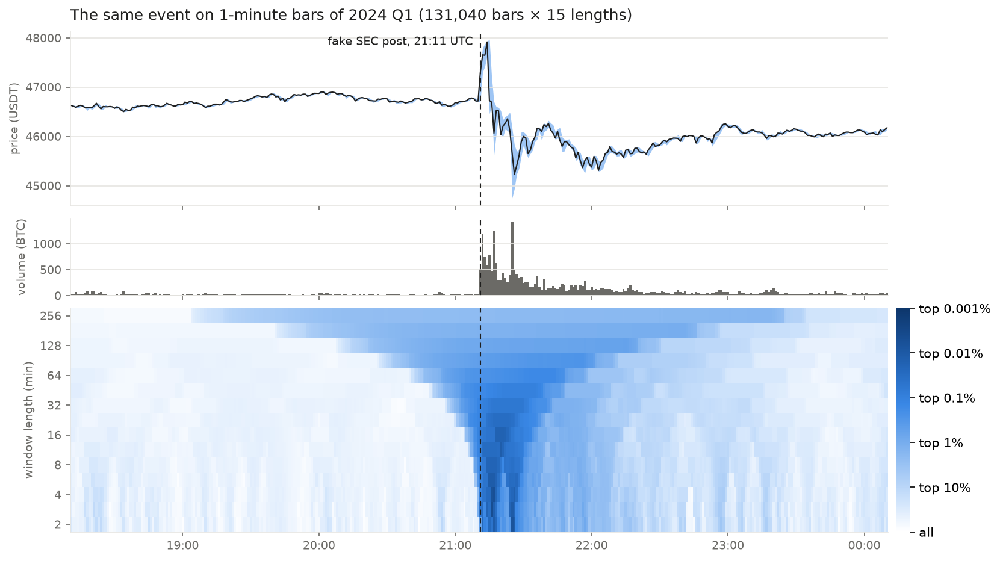
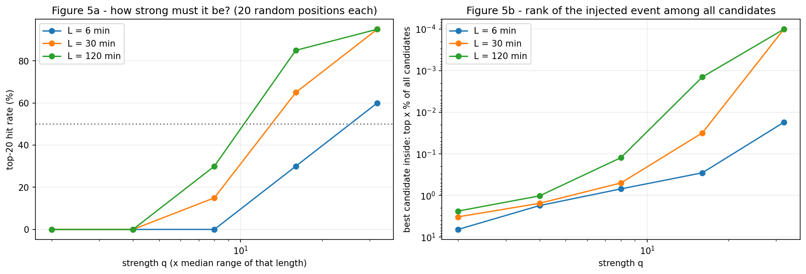
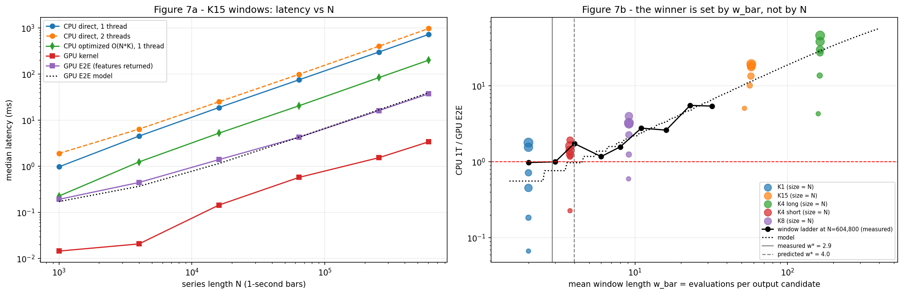
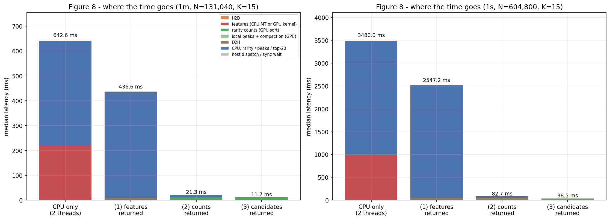
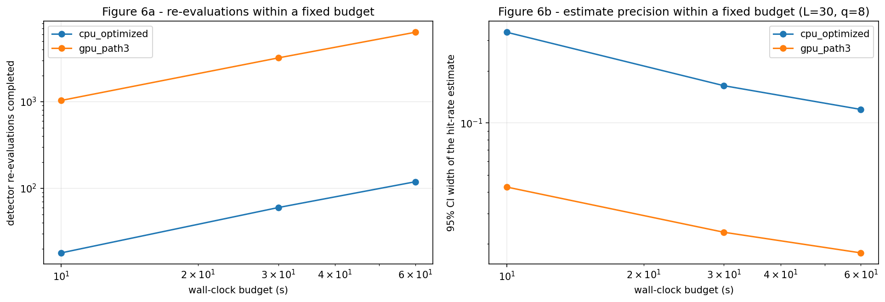

# Phase 0 — Scanning every window of a market time series on the GPU

**Status:** done (2026-10-04, Colab Tesla T4) ·
**Code:** [`experiments/phase0-pilot/`](../experiments/phase0-pilot/) ·
**Raw results:** [`results/colab-t4_2026-10-04/`](../experiments/phase0-pilot/results/colab-t4_2026-10-04/) ·
**Background and sources:** [`references.md`](references.md)

## The question

On 2024-01-09 at 21:11 UTC the U.S. SEC's X account was compromised and posted a fake approval of spot Bitcoin
ETFs. Bitcoin jumped by more than $1,000 within minutes and fell back once the post was denied. Market surveillance
looks for intervals like this one: periods where the price moved unusually far **and** unusually much was traded.

The difficulty is that nobody knows in advance how long such an interval is. It may last two minutes or four hours.
So the scan checks **every combination of start time and window length**. For three months of 1-minute bars and 15
window lengths that is about two million candidate intervals; at 1-second resolution it is nine million for a single
week. Each candidate is independent of the others, which makes the scan a natural fit for a GPU.

This pilot asks three things:

1. Can the scan be made **correct and comparable** on CPU and GPU, and does it find real events?
2. **When does the GPU actually win, and where does the time go** once the whole pipeline is counted, not just the
   GPU kernel?
3. A detector is usually evaluated by re-running it on many modified copies of the data. **What does a fixed time
   budget buy** on a CPU versus a GPU?

The third question is the one that shaped the rest of this project.

## Setup

| | |
|---|---|
| Data | Binance BTCUSDT spot, public archive. 1-minute bars for 2024 Q1 (131,040 rows), 1-second bars for 2024-01-08..14 (604,800 rows). No gaps needed filling |
| Score | For every (start, length): the price range (max − min) / min and the volume sum. Each is ranked against all intervals **of the same length**; the rarity is S = −log10(rank / count), using the less extreme of the two ranks. "S = 3" means both are in the top 0.1% for that length |
| Candidates | Keep points with S ≥ 2 that are the rarest within ±half a window, merge candidates closer than 60 bars into one episode, report the top 20 episodes |
| GPU | CUDA C++ kernels (1 thread = one (length, start) pair) compiled through CuPy `RawKernel`; sorting via CuPy (CUB) |
| CPU | Numba: a direct scan identical to the kernel, and an **optimized** O(N·K) version (sliding min/max with a monotonic deque, prefix sums) that serves as the fair baseline |
| Hardware | Google Colab, Tesla T4, Intel Xeon 2.0 GHz with 2 logical cores |
| Protocol | Hypotheses written before measuring; correctness gate first; warm-up then ≥ 10 repetitions, median reported; kernels timed with CUDA Events queued behind a spin kernel to exclude launch gaps |

## 1. Correct first

Before any timing, the GPU output had to match the CPU: exact min/max, floating-point tolerance on range and volume,
identical integer ranks, identical candidate flags, and the same top 20 from every GPU variant. Two deliberately
broken kernels (one drops the last valid start, one reads the wrong window length) had to be **caught as failures**.

| Check | Result |
|---|---|
| GPU features (two thread layouts), multi-threaded CPU, optimized CPU | pass |
| GPU rarity ranks, GPU candidate flags (exact) | pass |
| Broken kernel: boundary off by one | caught |
| Broken kernel: wrong window length | caught |
| Top 20 identical across CPU and all three GPU output paths | yes |

A gate that passes everything proves little; the two caught failures show that this one can tell a correct kernel
from a subtly wrong one.

## 2. Does the map find anything real?

Around the fake SEC post the rarity map lights up as a cone: short windows react first, and longer windows that
contain the event stay rare for longer. The horizontal axis is the window centre, the vertical axis the window
length, and darker means rarer.

At 1-second resolution the same event splits into three cones: the jump at 21:12, the pullback at 21:17, and the
drop at 21:25. Raising the resolution multiplies the number of windows by 60, which is where the GPU starts to
matter.

Over the whole quarter, the three highest-ranked episodes lie within 10 minutes of the Matrixport note on ETF
rejection (01-03), the Coinbase outage near $64k (02-28), and the SEC post (01-09). **Four of five** listed news
events are hit, against 0.09 expected by chance. This list was compiled after an earlier run, so it is an
observation, not evidence. Against a list fixed by rule in advance (every CPI release and FOMC statement in the
quarter) the hits are **one of five** (p = 0.086), which is not distinguishable from chance. The map finds large
market moves; it says nothing about their cause.

**Controlled injections.** To measure sensitivity, a pump-and-dump shape (rise over two thirds of its length, fall
over the last third) was added at random positions to copies of the real series, 20 times per setting.

| Event length | Strength where the top-20 hit rate first exceeds 50% |
|---|---|
| 6 min | between 16x and 32x the typical range of that length |
| 30 min | between 8x and 16x |
| 120 min | between 8x and 16x |

Weak events never reach the top 20 because the quarter itself contains larger real shocks. The map also reads the
length: at strength 16 the estimated length is 0.34–0.58 of the true length, inside the predicted band of one third
to one times the length (the fall, which lasts a third of the event, is where the price range is rarest).

## 3. When does the GPU win?

| N = 604,800, 15 windows | Median time |
|---|---|
| CPU direct scan, 1 thread | 726.5 ms |
| CPU direct scan, 2 threads | 975.0 ms |
| **CPU optimized, 1 thread** | **200.5 ms** |
| GPU kernel only | 3.4 ms |
| GPU end to end (upload, kernel, all features downloaded) | 37.4 ms |

The kernel is 59x faster than the optimized CPU, but end to end the margin is **5.4x**: downloading four features
for nine million candidates costs far more than computing them. Whether the GPU wins at all depends less on the
series length N than on how much work each candidate carries compared with the bytes it sends back. A cost model
calibrated on three points predicted the crossover at a window length of 4.0; the measured crossover was **2.85**
(within the 2x criterion), and the model picked the winner correctly in 83% of the untouched conditions.

*If downloading results costs more than computing them, what happens when less is downloaded?*

## 4. Where the time goes

Three GPU variants return different amounts of data. All three produce the same top 20.

| 1-second data, N = 604,800 | Total | Largest part |
|---|---|---|
| CPU only (2 threads) | 3,480 ms | ranking and candidate selection on the CPU (2,490 ms) |
| (1) GPU computes features, CPU does the rest | 2,547 ms | the same CPU ranking (2,478 ms) |
| (2) GPU also ranks, CPU selects candidates | 82.7 ms | GPU sort (27.9 ms), CPU selection (40.1 ms) |
| (3) GPU does everything, returns only candidates | **38.5 ms** | GPU sort (27.9 ms, 72%) |

- With all features returned, the download is 82% of the GPU-side time (33.1 of 40.3 ms).
- Returning only candidates is **66x** faster than returning features. Most of that (31x) comes from moving the
  per-length ranking off the CPU; removing the remaining download and CPU selection adds another 2.1x.
- Once everything runs on the GPU, the kernel that was the obvious target is a small part. The **per-length sort**
  now takes 72% of the time.

On the 1-minute data the same holds at smaller scale: 643 ms on the CPU, 11.7 ms for the candidates-only path.

**Thread layout.** If neighbouring threads handle different window lengths, every warp waits for the longest window.
The predicted slowdown was 4.4x; the measured one was **3.6x** (2.44 ms vs 8.74 ms), within the 35% criterion and on
the expected side, since that layout reads memory slightly more efficiently.

## 5. What a fixed time budget buys

A detector is rarely run once. To know how sensitive it is, it is re-run on many modified copies of the data and the
fraction of detected cases is estimated, as in the injection experiment above. That estimate is a Monte Carlo
estimate: its uncertainty shrinks only with the square root of the number of runs. The number of runs that fit into
the available time therefore decides how precise the answer is.

Two experiments were kept strictly apart. Both re-run the complete detector (all 15 lengths over the full quarter)
on injected copies, at a strength near the detection threshold.

**Same workload** (the same 40 trials on both sides): the optimized CPU pipeline takes **493 ms** per trial, the GPU
candidates-only path **10.6 ms** (46x). Both made the same decision in all 40 trials.

**Same time budget** (each side runs fresh trials until the time is up):

| Budget | CPU trials | GPU trials | 95% interval width, CPU | 95% interval width, GPU |
|---|---|---|---|---|
| 10 s | 18 | 1,032 | 0.334 | 0.043 |
| 30 s | 60 | 3,195 | 0.164 | 0.023 |
| 60 s | 119 | 6,312 | 0.120 | **0.018** |

In 60 seconds the GPU completes 53x more trials and its interval is 6.7x narrower, close to the √53 ≈ 7.3 that the
square-root law predicts. Read the other way: the precision the GPU reaches in 10 seconds would take the CPU roughly
**eight minutes** (extrapolated with the same square-root law).

This is the result that matters for what comes next. The speed of a single scan is a convenience; the number of
re-evaluations per unit of time decides **how well a detector's behaviour can be measured at all**.

## 6. Hypotheses

Written before the run; all criteria are in the notebook header.

| | Hypothesis | Result | Verdict |
|---|---|---|---|
| H1 | The GPU's end-to-end win is set by work per candidate vs bytes per candidate, not by N; a cost model predicts the crossover | crossover 2.85 vs 4.00 predicted; winner predicted correctly in 83% | supported |
| H2 | Returning all features, the download dominates the GPU-side time | 82% | supported |
| H3 | Returning only candidates is at least 2x faster than returning features | 66x (31x from moving the ranking, 2.1x from the rest) | supported |
| H4 | Mixing window lengths in a warp slows the kernel by about 4.4x | 3.6x | supported |
| H5 | The map reads event length as one third to one times the true length | 0.34–0.58 at strength 16 | supported |
| H6 | A minimum detectable strength exists in the tested range | 50% crossed between 8x and 32x for every length | supported |
| H7 | In the same time budget the GPU completes more re-evaluations and its estimate narrows as 1/√n | 53x more trials, 6.7x narrower (7.3x predicted) | supported |

## 7. What this changed

- **The kernel is not the problem.** After moving everything to the GPU, ranking and data movement dominate. Work on
  performance has to look at the whole pipeline and at what is sent back, not at the kernel alone.
- **The CPU baseline has to be strong.** The optimized CPU is 3.6x faster than the direct scan, and every GPU claim
  above is made against it. Its ranking step still runs single-threaded in NumPy, so the next phase writes the CPU
  baseline in C++ with parallel sorting.
- **The gate stays.** Correctness checks with deliberately broken variants run before every timing.
- **The real question is evaluation under a time budget.** Section 5 is the seed of this project: when a detector or
  policy must be evaluated over many scenarios, the achievable precision is bounded by how many evaluations fit into
  the available time.

## Scope of the numbers

- One Colab session: a Tesla T4 and two logical CPU cores. The two-thread CPU scan was slower than one thread on
  this machine; CPU ratios will differ on a larger CPU.
- The CPU baseline's ranking uses single-threaded NumPy sorting, and host code is Python (CuPy, Numba). Kernel times
  are unaffected; launch overheads and the CPU side would change in a C++ implementation.
- A few "dispatch overhead" values for large kernels are slightly negative; they are the difference of two
  separately measured medians and should be read as zero.
- Injected events are synthetic and multiply prices without any market reaction. Ranks are taken over the whole
  quarter, so volatile periods dominate the top of the list.
- The news-event list was compiled after an earlier run; only the rule-based macro list supports a p-value.
- The rarity maps in this document are redrawn by [`make_figures.py`](../experiments/phase0-pilot/make_figures.py) from
  the same computation on the CPU (ranks are integers and matched the GPU exactly). In the notebook's own Figures
  2-4 a colour bar narrows only the map panel, so the dashed event line appears slightly shifted between panels.
- Nothing here judges whether any trading was manipulative.
