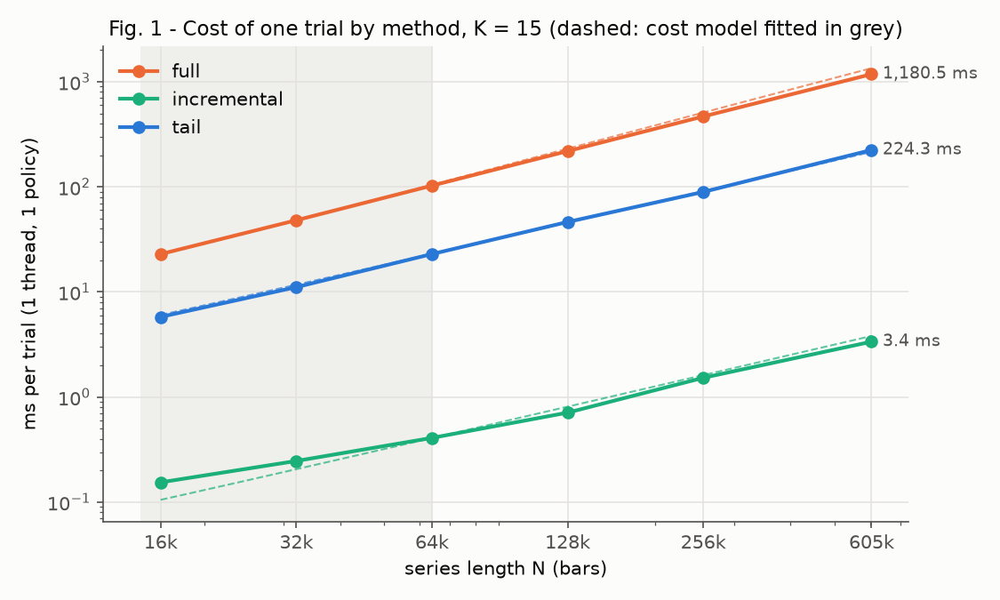
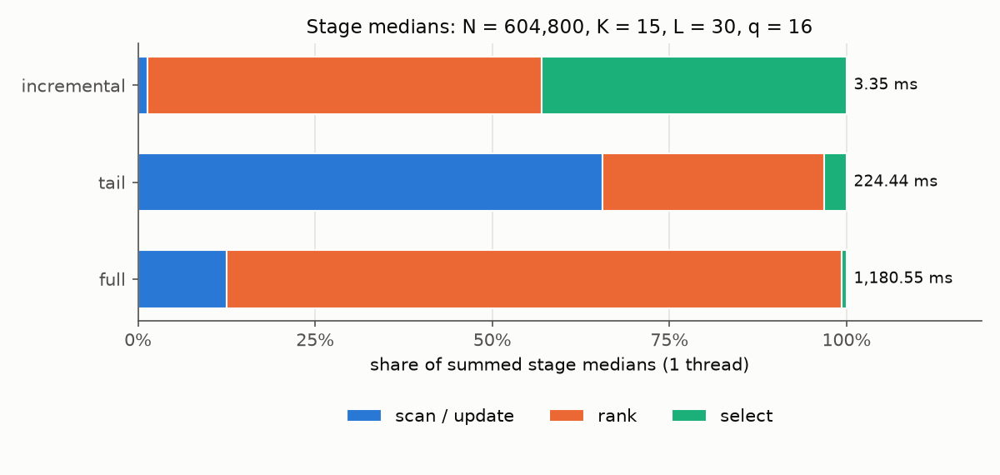
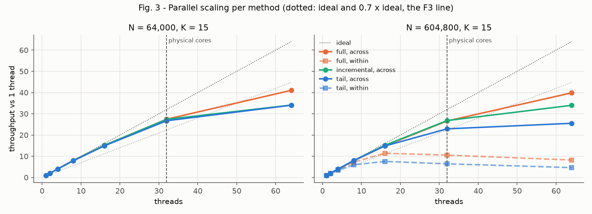
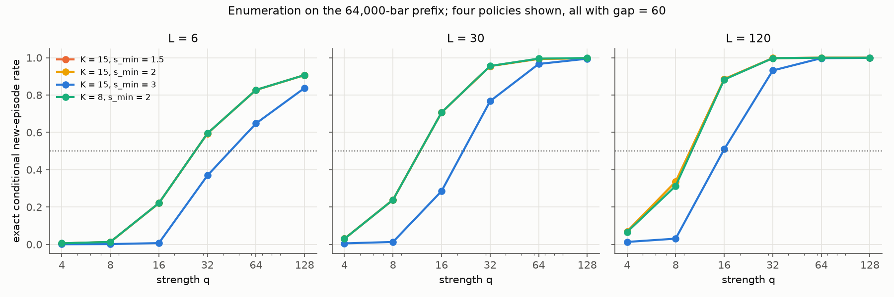

# Phase 1 — What does a stated stress-testing task cost on a strong CPU?

**Status:** done (reference run 2026-10-09, AWS `c7i.16xlarge`, commit `bc9cd9c`) ·
**Code and frozen hypotheses:** [`experiments/phase1-feasibility/`](../experiments/phase1-feasibility/README.md) ·
**Raw results:** [`results/aws-c7i-16xlarge_2026-10-09/`](../experiments/phase1-feasibility/results/aws-c7i-16xlarge_2026-10-09/) ·
**Engine:** [`engine/`](../engine/README.md)

## The question

Phase 0 ended on one observation: when a detector is evaluated by re-running it on many modified copies of the data,
the number of re-runs that fit into the available time decides how precisely its behaviour can be measured. In 60
seconds a T4 GPU completed 53x more re-runs than the CPU. That ratio was measured against a CPU that re-ran the
whole detector for every trial, ranked with single-threaded NumPy, and had two logical cores. It said little about
whether a well-implemented CPU actually runs out of time on a real task.

Before any GPU engine is built, Phase 1 asks that question directly, as hypothesis **H2** of the project:

> For stress-testing tasks with a stated accuracy, even the fastest exact CPU method, not just a full re-run of the
> detector, needs more time than is available.

Three sub-questions make H2 testable:

1. **What exactly is estimated, and how many trials does a stated accuracy need?** Without a defined quantity and
   accuracy there is no task, only a loop that could run forever.
2. **What is the cheapest exact way to run one trial on a CPU?** Re-running the full detector is one option, not the
   floor. Any faster method has to return exactly the same answer.
3. **How long does each task take** with each method on a strong reference machine?

The decision rule was written down before the reference run: for each task, if the fastest exact method finishes
in **under one hour**, the CPU is not the bottleneck for that task and the GPU comparison of Phase 2 moves to larger
tasks; over one hour, H2 is supported for it and Phase 2 compares CPU and GPU on that task. "Full recomputation is
slow" alone does not count as support.

## Setup

| | |
|---|---|
| Data | Binance BTCUSDT spot, public archive. 1-minute bars for 2024 Q1 (N = 131,040) and 1-second bars for 2024-01-08..14 (N = 604,800). Two workloads of different length, not a resolution comparison: their windows and periods differ in real time |
| Detector | The Phase 0 rarity scan rewritten in C++17/OpenMP ([`engine/`](../engine/README.md)): price range and volume for every (start, window length), per-length rarity ranks, local peaks, episodes merged within a gap |
| Policies | A policy is (K window lengths, rarity threshold s_min, episode gap). P1 = the default (K = 15, s_min = 2, gap = 60); P24 = K 8/15 × s_min 1.5–3 × gap 30/60/120; P105 adds K = 4 and more thresholds and gaps |
| Trial methods | full, shared, tail, incremental (section 2); all must return bit-identical episodes |
| Machine | AWS `c7i.16xlarge`: Intel Xeon Platinum 8488C, 1 socket, 32 physical / 64 logical cores, 1 NUMA node, 128 GB; Ubuntu 24.04, GCC 13.3, `OMP_PLACES=cores OMP_PROC_BIND=spread` |
| Protocol | Engine and Phase 0 reproduction gates first; 200 time-budget configurations × 3 repetitions at 5 s, plus 33 gate and 27 fixed-trial validation records (660 records total); non-gate records in one seeded shuffled order; timed medians reported; throughput = steady-state rate summed over workers; each worker first-touches its own memory |
| Hypotheses | G, F1–F4, E1 and the H2 decision rule were committed on 2026-10-07 (`bc9cd9c`) after a design review; the reference run used that commit unchanged (`git_dirty: false`) two days later |

The pre-registration is a commit in this repository, not an external registry: the order of events is visible in
the history, but it is not independently certified.

## 1. What is estimated

For a policy π, the fixed series x, and a synthetic test event of length L and strength q (the Phase 0 rise-and-fall
shape added at a start s), the **conditional detection rate** is

> p<sub>π</sub>(L, q | x) = the share of all valid starts s at which π reports a **new** episode centred inside the
> event, i.e. one that is not among π's episodes on the unchanged series.

Strength q is relative: each low/high price is multiplied by `1 + q × median_range(L) × shape(j/L)`,
where the range is `(max(high) − min(low)) / min(low)` and the rise-and-fall shape is sampled at bar midpoints.
For the default event, volume is also multiplied by `1 + q`. Thus q couples price and volume changes, and equal q
does not mean an equal price change across lengths. An episode is new exactly when its `(window index, start)`
pair is absent from the base episodes; changing only its score does not make it new. Selection keeps at most 20 episodes.

What this quantity is and is not:

- It is **conditional on x**. Its intervals say nothing about other weeks, regimes, or assets.
- It is **not a damage bound**. A worst-case undetected effect needs a damage function, an admissible scenario set,
  and a bound direction (a maximum found by search is only a lower bound on the worst case). None of these is
  defined or claimed in Phase 1.
- It is **exactly computable on small problems**: evaluating every start (enumeration) gives p without sampling
  error. That is how the interval method is checked (section 5).
- It comes with **controls**: q = 0 (nothing changes, so no new episode may appear), price-only and volume-only
  events, and the *overlap* rate (any episode centred in the event, new or not; the Phase 0 definition).

A Monte Carlo trial draws one start uniformly and evaluates every policy of the task on it. Intervals are
Clopper–Pearson. (Wilson intervals were the first choice; the smoke run showed them undercovering near p = 0, so they
were replaced before the reference run.) The trials per cell are the smallest n whose interval half-width is at most
h at the widest interval (the central success count, k ≈ n/2), at 95% pointwise or at least 95% simultaneous
coverage. Here half-width means `(upper − lower) / 2`; a Clopper–Pearson interval is generally asymmetric about
the sample proportion, so this is not a strict ±h error guarantee around that proportion:

| Task | Question | Policies | Cells (L × q) | Coverage, half-width | Trials per cell | Trials in total |
|---|---|---|---|---|---|---|
| T1-curve | How does the default policy's rate change with event length and strength? | 1 | 8 × 17 (L = 2…256 in steps of x2, q = 1…256 in steps of x√2) | pointwise, h = 0.02 | 2,449 | 333,064 |
| T2-policy-map | The same for 24 policy settings, all 3,264 intervals holding at once | 24 | 8 × 17 | simultaneous (Bonferroni), h = 0.02 | 11,726 | 1,594,736 |

In T2 one trial serves all 24 policies, so 1,594,736 is the number of trials, not of policy evaluations. Around T1,
one factor at a time is varied (half-width, strength step, number of lengths, policy grid, coverage); those
"ladders" are in [`tables.md`](../experiments/phase1-feasibility/results/aws-c7i-16xlarge_2026-10-09/tables.md).

## 2. Four exact ways to run a trial

| Method | Per trial | Why it returns the same episodes |
|---|---|---|
| full | every policy re-runs the scan, a full sort per window length, and selection | the reference |
| shared | one scan and one full ranking at the largest K, shared by all policies; per-policy filter and merge | rows are independent per length; peaks do not depend on s_min, K, or gap |
| tail | as shared, but ranks only the values that can still reach the threshold (selection + small sort) | a start outside that tail can neither be a candidate nor outrank one |
| incremental | recomputes only the windows that overlap the event and merges them into the base series' precomputed orderings | the changed row's tail follows exactly from the old ordering minus the replaced starts plus their new values |

"Exact" is meant literally. All scan paths produce the same feature bits (float32 prices, volume in fixed point with
a 2<sup>−24</sup> unit, integer rarity counts, fixed tie-breaking and greedy merge), so episodes are compared for
equality, never within a tolerance. This is exactness with respect to the engine's own specification, which is also
the specification a GPU implementation has to reproduce; it is not a claim that the detector is a correct model of
any real surveillance system.

Even the reference is not a naive scan: full already uses sliding min/max and running fixed-point volume sums. The comparison below is
between exact algorithms, not between bad and good code.

### Correct first

| Gate | Result |
|---|---|
| `sf_test`: synthetic tie-heavy data, 18 policies × 42 events (both series ends, L = 2/30/256, q = 0/4/32, three event kinds), four deliberately broken variants | passes; all four broken variants caught |
| `check_phase0.py`: the C++ engine reproduces the Phase 0 top 20 on 2024 Q1 | match |
| **G** — real data: shared, tail, incremental vs full on every trial, all 24 policies | **0 mismatching trials of 2,112** |

The 2,112 trials are 33 configurations × 64 trials: 576 per method on the 1-minute quarter and 128 on the 1-second
week, where only L = 30 with q = 0 and q = 128 enter the real-data gate. The synthetic method gate uses K = 4/8/15, s_min = 1.5/2/3, gaps 30/60, and only L = 2/30/256,
q = 0/4/32. It does **not** cover the complete P105 grid, intermediate event lengths, or q = 256; these are also
absent from the real-data differential gate. G is a measured differential check, not a
proof for all inputs.

## 3. Full recomputation is not the CPU's floor

<p align="center"></p>

| N (K = 15, one policy, 1 thread) | full | tail | incremental |
|---|---|---|---|
| 64,000 | 102.75 ms | 22.95 ms | 0.41 ms |
| 604,800 | 1,180.55 ms | 224.27 ms | **3.36 ms** |

**F1 holds by a wide margin: incremental runs 349x more trials per second than full** at N = 604,800 (criterion
≥ 10x). Tail alone gives about 5x.

<p align="center"></p>

These cost measurements use L = 30, q = 16 and exclude setup. The Figure normalizes the sum of separately
computed stage medians; that sum need not equal the median whole-trial time in the table.
The time moves, as it did in Phase 0, away from the step that looked like the obvious target. In full, ranking is
87% of a trial (1,025.6 of 1,180.6 ms). Tail cuts ranking to 70 ms and leaves the scan as the largest part.
Incremental removes nearly all of the scan (0.04 ms); what remains is merging the changed windows into the
orderings (1.87 ms) and selection (1.44 ms, 43%).

**F2** asked whether each method's cost model, fitted on N ≤ 64,000, predicts N = 604,800 within 20% for every K.
It does for the three methods in the cost sweep, but with little room for incremental:

| Prediction error at N = 604,800 | K = 4 | K = 8 | K = 15 |
|---|---|---|---|
| full (a + b·NK + c·NK·log N) | +0.4% | +2.9% | +14.0% |
| tail (a + b·NK) | −15.5% | −5.7% | −4.2% |
| incremental (a + b·NK) | +19.3% | +18.3% | +13.4% |

Two limits on reading this. The criterion was only checked at N = 604,800; at N = 128,000 the same incremental model
is off by +32.8% and +31.2% (K = 4 and 8), so the models are not accurate over the whole measured range. And the fitted
coefficient on N·K for full is negative, so individual coefficients should not be read as stage costs. None of the
time-to-solution numbers below uses these models; they use measured throughput.

**When incremental is cheap.** Its advantage depends on the event being short and local, the base series fixed, and
the base orderings reusable. It still merges a tail whose size grows with N and with lower thresholds
(cap = ⌊N<sub>k</sub> · 10<sup>−s<sub>min</sub></sup>⌋), and each worker holds K × N counts. Other event shapes,
lower thresholds, or many series would change both the gain and the memory.

## 4. Using all cores

Trials are independent, so the natural parallelisation is *across* trials, one per thread.

<p align="center"></p>

**F3** required at least 0.7 × 32 × the single-thread throughput at 32 threads, for every measured method and N. The
lowest median efficiency is **0.72** (tail at N = 604,800); full and incremental reach 0.83–0.86. The pass is narrow:
matching the three repetitions of the tail configuration by repetition number gives 0.72, 0.68, and 0.75. The verdict
stays as specified on the median; that it would hold in every repetition is not established. At 32 threads tail's
ranking stage takes 1.89x longer per trial than on one thread; whether memory bandwidth, cache, or clock frequency is
the cause cannot be decided without hardware counters, which were not recorded.

Two descriptive results matter for later comparisons:

- **SMT helps.** At N = 604,800, 64 threads give 1.50x (full), 1.11x (tail), and 1.27x (incremental) the throughput
  of 32 threads. The projections below use 32 threads, as specified, so they are not the machine's best CPU time.
- **Parallelising within a trial saturates early.** Splitting the K window lengths of one trial over threads peaks at
  16 threads (11.4x for full, 7.6x for tail) and then gets slower. For tasks made of many independent trials,
  across-trial parallelism is the right CPU baseline.

## 5. Can the interval method be trusted?

Before timing a task by its trial count, the trial count has to deliver the stated coverage. **E1** checks this on a
64,000-bar prefix of the 1-second week, where every start can be enumerated: exact p for 3 lengths × 6 strengths ×
24 policies = 432 cells, then 2,000 replayed Monte Carlo runs at each half-width.

<p align="center"></p>

The curves for s_min = 1.5 and s_min = 2 (K = 15) almost coincide and are drawn on top of each other.

| Nominal h | n per cell | Pointwise coverage, mean / lowest cell | All 432 intervals at once, unadjusted | All at once, Bonferroni |
|---|---|---|---|---|
| 0.05 | 402 | 0.970 / 0.945 | 0.111 | 0.995 |
| 0.02 | 2,449 | 0.961 / 0.940 | 0.042 | 0.994 |

**E1 holds**: no cell falls below the pre-set floor of 0.931 (0.95 minus 4 replay standard errors), and Bonferroni
intervals hold jointly in more than 95% of runs. The lowest replayed cells (0.940–0.945) are replay noise, not
undercoverage: summing the binomial probabilities at each stored exact p gives a lowest true coverage of 0.9506
(n = 402) and 0.9502 (n = 2,449). The middle column is why T2 needs simultaneous intervals: with 432 unadjusted 95%
intervals, all of them hold in only 4–11% of runs.

Scope of E1: it checks coverage on the prefix, not on a full T2 run. The Bonferroni replay kept the pointwise n and
widened the intervals (largest half-width 0.096 and 0.039), so it shows joint coverage, not a joint interval half-width of 0.02 at
n = 2,449; T2's n = 11,726 for 3,264 intervals follows from the same Clopper–Pearson calculation but was not replayed
end to end. Starts are drawn with replacement, so serial correlation inside the series does not break the binomial
model; the intervals still do not cover other periods or assets.

**The exact curves are not monotone in strength.** Of 360 adjacent strength pairs across the 72 (length, policy)
curves, **12 decrease**, all at L = 120 from q = 64 to q = 128, by at most 0.36 percentage points. In one of them
(K = 8, s_min = 1.5, gap = 120) the rate falls from 0.9981 to 0.9945: 54 starts become detected and 282 stop being
detected. These are exact rates, so this is not Monte Carlo noise. Global re-ranking, the top-20 limit, the greedy
merge, and the definition of a "new" episode are candidate causes; the stored hit bits cannot tell which. The
practical consequence is that search methods assuming monotonicity in q (bisection for a detection threshold)
have no general guarantee here; forcing a monotone curve by isotonic smoothing would change the target curve.

The `strength_error_at_50pct` column in `estimator.csv` (0.076 and 0.030) is a slope-based approximation of how a
±h error in p translates into strength near the 50% crossing, not a replayed error; it is not used as a result here.

## 6. Time to solution — the H2 verdict

Time-to-solution is projected from measured batch throughput: every policy of the task evaluated in each trial, all
32 physical cores, the median of 3 repetitions at the nearest measured event length in log space (2, 30, or 256),
plus the largest median setup of those three lengths. All batch rates are measured at q = 16 and reused for the
17 task strengths. These are projections for a prepared evaluator, not completed runs of T1 and T2.
The scenario sweep checks q = 0/8/128 only for P24 tail/incremental on the week; it does not validate costs across
the full task grid (including q = 256).

<p align="center"></p>

| Task | Series | full | shared | tail | **incremental** |
|---|---|---|---|---|---|
| T1-curve | 1-min quarter | 48.5 min | not measured | 12.1 min | **11.1 s** |
| T1-curve | 1-s week | 4.0 h | not measured | 52.6 min | **42.9 s** |
| T2-policy-map | 1-min quarter | 3.1 days | 3.9 h | 1.0 h | **3.0 min** |
| T2-policy-map | 1-s week | 15.2 days | 19.4 h | 4.7 h | **12.1 min** |

**H2 is not supported for T1 or T2.** Under the stated projection assumptions, the fastest measured exact method
is below one hour for each
task; the hardest case, T2 on the 1-second week, is projected at about 12 minutes, roughly 5x below the line.
Projecting from each repetition separately gives 12.1–12.4 min for that case and 42.8–42.9 s for T1 on the week, so
this repetition range does not cross the decision line. The P1 scaling sweep suggests testing 64 threads, but
P24 and P105 batch rates at 64 threads were not measured.

The same holds across the one-factor ladders around T1 on the 1-second week (incremental, from
[`tables.md`](../experiments/phase1-feasibility/results/aws-c7i-16xlarge_2026-10-09/tables.md)): half-width 0.01
takes 2.8 min, simultaneous coverage 2.3 min, 105 policies 2.6 min, 15 lengths 1.3 min. Had full recomputation been
the only method, T2 on the week would have been read as a 15-day task.

Policy count is not the main cost driver in these measured incremental batches. On the week at L = 30 it runs
about 8,005 trials/s for
P1, 2,188 for P24, and 2,200 for P105. P24 and P105 share the same largest K and lowest threshold (s_min = 1.5),
which sets the size of the tail to merge; going from 24 to 105 policies costs almost nothing. That is consistent
with the threshold, not the policy count, being what slows P24 down relative to P1, but the run was not designed to
separate the two, so it remains a candidate explanation.

### How far the projection was checked (F4)

**F4** compared the projection with an actual run of a small validation task (lengths 6/30/120, strengths 8/32/128,
24 policies, 3,618 trials on the week): **−2.1% (shared), +0.4% (tail), −4.4% (incremental)**, inside the 15%
numerical criterion **for the trial loop**. The frozen protocol calls F4 an end-to-end check, so that hypothesis
is only partially evaluated; the stored `hypotheses.csv` labels the narrower calculation `True`. In particular:

- Both sides count only the timed trial loop. Setup (loading, base state, per-length preparation, worker warm-up)
  is excluded. Each of the 9 validation cells ran in its own process; with their setups added, incremental takes
  4.5 s instead of 1.7 s. The task projections add setup once per task, which assumes a runner that keeps the base
  state and workers alive; that runner was not part of the run.
- Full was not in the pre-specified validation methods.
- Throughput is the steady-state rate per worker (trials completed / time of its last completion). For P24 with full,
  each worker finished its single timed trial after the 5-second budget (26 s on the week), so the "steady state" is
  one trial per worker there. Over all records, completed trials / wall time is at most 3.9% below the reported rate.

F4 supports the projection of **trial-loop time** for a prepared evaluator, not the frozen end-to-end claim.
As a diagnostic, adding one measured setup to the incremental projection gives 1.96 s, while the nine observed
setups plus loops total 4.46 s (−56.1%); those execution boundaries differ. A persistent task runner was not
measured. The observed timing variation is small relative to the roughly 4.9-fold margin to one hour, so the
projection provides evidence against H2 for these tasks. It does not bound all unmeasured setup, aggregation, or
scenario costs. End-to-end completion and accuracy remain to be checked in Phase 2.

### A table that is not used

`tasks_variance_aware.csv` shows what allocating fewer trials to cells far from p = 0.5 would save (T2 on the week:
12.1 → 4.8 min). It is kept in the run folder as an exploration and is **not** a result. The p-map behind it comes
from the 64k prefix at three lengths and six strengths and is applied to all lengths, strengths, and both series;
it is not filtered by the task's policies (so P105 is not covered); and allocating n from a p estimate does not
guarantee the interval width. On the full week at L = 30, q = 128, the default policy's rate is about 0.954 against
0.997 on the prefix. For this cell, the exploratory pointwise allocator chooses n = 137 from a different policy
(the prefix rate nearest 0.5, about 0.995). At 6 hits out of 137, close to the full-week rate, the interval half-width
is 0.0383 instead of 0.02. Using only the default policy's prefix rate would choose n = 91 and is no remedy.

## 7. Controls and what the rate means

From the `scenario` part on the full 1-second week (default policy, incremental, median over repetitions):

| L | q = 0 | q = 8 | q = 128, both features | q = 128, price only | q = 128, volume only |
|---|---|---|---|---|---|
| 2 | 0 | 0.0004 | 0.0004 | 0 | 0.0004 |
| 30 | 0 | 0.0022 | 0.954 | 0.0050 | 0.0021 |
| 256 | 0 | 0.0123 | 0.999 | 0.0131 | 0.0181 |

- **q = 0 gives no new detections** in any of the 30 measured q = 0 records (gate and scenario parts) and any
  policy, as the definition requires. The overlap rate at q = 0 is small but positive, because some starts lie inside
  episodes the base series already has; that is why the new-detection rule is the target and overlap only a reference.
- **Single-feature events are rarely detected**, but not never: when only one feature is changed, the other can
  already be rare at that point in the real series.
- **Very short events are almost never detected, even at q = 128.** This is not a finding that the detector misses
  strong events. Because q scales the median range of length L, q = 128 at L = 2 is a far smaller price change than
  at L = 30, and the episode centre must also fall inside a two-bar event.

These rates are descriptive statistics of time-limited runs, with different numbers of trials per method and seeds
reused across repetitions. Method agreement is established by the differential gate G, not by comparing these rates.

The definition itself is a modelling choice. The same real event counts as new if a slightly shifted window
reports it, and does not count if it only strengthens an episode the base already contains. The q = 0 control is
necessary for this rule, but it does not make it the "true" definition of detecting an event.

## 8. Hypotheses

All criteria were fixed before the run in the [Phase 1 README](../experiments/phase1-feasibility/README.md). The
verdicts below distinguish the stored numerical checks from the scope promised by those criteria, especially F4.

| | Hypothesis | Result | Verdict | Scope |
|---|---|---|---|---|
| G | Shared, tail, incremental return the same episodes as full on real data, all 24 policies | 0 of 2,112 trials mismatch | passed | Measured trials only; on the week only L = 30, q = 0/128; P105 not in the real-data gate |
| F1 | Full recomputation is not the CPU's cost floor (≥ 10x) | 349x (incremental vs full) | supported | N = 604,800, K = 15, one policy, 1 thread |
| F2 | Cost models fitted on N ≤ 64,000 predict N = 604,800 within 20% | worst 14% / 15% / 19% (full / tail / incremental) | supported | Measured methods only (shared not in the cost sweep); fails at N = 128,000 for incremental |
| F3 | ≥ 0.7 parallel efficiency at 32 threads, across mode | lowest median 0.72 (tail, N = 604,800) | supported | Medians; one repetition at 0.68; shared not in the scaling sweep |
| F4 | Projection within 15% of an end-to-end validation task | −2.1% / +0.4% / −4.4% for loops only | partially evaluated | Loop criterion passes; frozen end-to-end claim unverified; full not included |
| E1 | Clopper–Pearson keeps coverage against exact rates | lowest 0.940 vs floor 0.931; Bonferroni 0.994–0.995 | supported | 64k prefix, 432 cells; not a full T2 replay |
| **H2** | Even the fastest exact CPU method needs more than the available time (1 h) | T1: 11 s / 43 s; T2: 3.0 / 12.1 min | **not supported** for T1 and T2 | Projected; 32 cores of one machine; one unit (series) per trial |
| H1, H3, H4 | Policy comparison; GPU time and error | — | not tested | No group-level policies, damage function, or GPU in Phase 1 |

## 9. What Phase 1 establishes, and what it does not

**Established, within the stated scope:**

- A target quantity with a definition, controls, and an exact reference on small problems, and intervals whose
  coverage was checked against that reference rather than assumed.
- Four trial methods that return bit-identical episodes, with a gate that catches deliberately broken variants. The
  fastest is 349x faster than full recomputation on one thread.
- Throughput-based time-to-solution projections for two stated tasks, judged by a decision rule written before
  the run. These provide evidence against H2 under the projection assumptions: incremental CPU evaluation is
  projected to put both tasks within minutes on this machine.
- The detection rate is not always monotone in event strength, so threshold search cannot assume it is.
- The choice of CPU algorithm moved the cost of T2 on the week from about 15 days (full) to about 12 minutes,
  a ratio of about 1,802x for this policy batch. This is not a CPU–GPU speed comparison; the 53x GPU ratio
  from Phase 0 cannot be carried over to this baseline: the
  machine, the CPU algorithm, policy batching, and the detection rule all changed.

These are empirical and engineering contributions for this detector: a reusable exact CPU baseline, an explicit
conditional estimand, and a feasibility result that changes the appropriate GPU comparison. Phase 1 does not
establish algorithmic novelty, a new confidence-interval method, or a general surveillance result.

**Not established:**

- **The GPU question (H3, H4).** No GPU was used. Phase 1 says nothing about whether a GPU is faster than incremental
  CPU evaluation, only that the measured CPU rates project T1 and T2 below one hour.
- **A lower bound on CPU time.** Incremental is the fastest of four exact methods measured, not a proven optimum.
- **Complete task runs.** T1 and T2 times are projections from measured throughput, checked on the trial loop of a
  small task (F4), not runs from input to final intervals.
- **Generality.** One asset (BTCUSDT), one quarter and one week, one machine. The exact reference for E1 is a 64k
  prefix and covers that prefix's estimand. The AWS run did not record checksums of its input files.
- **Anything about damage or policies (H1).** P24 is a grid of detector parameters, not a comparison of
  account-level and group-level policies, and no damage bound is defined yet.

## 10. What this means for Phase 2

H2 as stated is not supported for T1 and T2, and it stays that way: the tasks and the one-hour line are not changed
after the fact to produce a GPU motivation. The rule fixed before the run already says what follows: the GPU
comparison of Phase 2 moves to larger tasks (more units, a more expensive detector, or bounds once they are defined).
Which of these, with which accuracy target and decision line, is **not decided yet**. What follows from the result:

- **The CPU baseline is incremental**, the fastest verified exact method, measured at both 32 and 64 threads for
  P1, P24, and P105 **in Phase 2** (Phase 1 measured 64-thread scaling only for P1). A GPU's speed relative to full
  recomputation is reported only as an implementation note.
- **T1 and T2 stay as reference tasks projected feasible on the CPU.** A GPU engine is compared on them at the same
  estimand, coverage, and accuracy, and its result is reported whether it is faster, equal, or slower.
- **A real task runner comes first**: base state and workers kept alive, per-length preparation, per-policy
  aggregation, intervals, and output, so that time-to-solution is measured end to end (cold and warm) and F4 can be
  checked on that boundary. A completed run must also verify the requested interval widths. Fixed-budget
  comparisons count only trials finished before the deadline and include setup.
- **The trial stream must not depend on the hardware.** Trial positions are currently drawn per worker
  (seed + worker id, dynamic scheduling, warm-up), so CPU and GPU runs with the same seed do not see the same trials.
  Phase 2 needs positions fixed by (cell, trial id) so that error-vs-time curves compare like with like.
- **The correctness gate extends to the GPU**: all policies, ties, both series ends, q = 0 and single-feature
  controls, tail-cap boundaries, and floating-point rounding, against the same feature-bit specification.
- **Larger tasks get their own pre-set criteria, not a rescue of H2.** Whichever larger task Phase 2 takes up (for
  example more independent series per trial, which the Phase 1 plan already reports as a separate factor), the task,
  its accuracy target, and the decision rule are fixed before measuring, and T1 and T2 are reported alongside. As plain arithmetic, not a measurement: if time grew linearly with the number of series, T2 on
  the week would cross one hour at five series. Whether it grows linearly, and what memory and setup cost, has to be
  measured.
- **Variance-aware allocation is a separate validation task**, with its own pilot over the task's full range, an
  allocation that guarantees the width, and the pilot's cost counted in the time.

## Reproducing

The run folder contains everything the tables and figures are computed from: `cpu_sweep.jsonl` (all 660
records), `estimator_cells.csv` (432 exact rates), `env.json`, and `raw_hits.tar.gz`, the per-start detection
indicators from enumeration (18 uint8 files, 27,625,968 bytes; one byte per binary indicator) that the coverage
replay draws from. `SHA256SUMS` lists the
checksums of 31 payload files, including the 18 unpacked hit files, but not itself; it was recorded after the
results were copied back from the reference machine. These checksums verify the saved payload, not the original
input data or execution provenance. A post-run audit rechecked all 31 hashes, all 432 rates from the hit bytes,
and the seeded coverage replay; the commands below repeat these checks. The historical result files, including
their F4 verdict, are preserved.

```bash
run=experiments/phase1-feasibility/results/aws-c7i-16xlarge_2026-10-09
# checksums: unpack the hit files in a copy first (raw/ is not committed)
audit_copy=$(mktemp -d)/aws-c7i-16xlarge_2026-10-09
cp -a "$run" "$audit_copy"
tar xzf "$run/raw_hits.tar.gz" -C "$audit_copy"
(cd "$audit_copy" && sha256sum -c SHA256SUMS)
# historical tables, verdicts, and run figures, written into the copy
python experiments/phase1-feasibility/make_figures.py "$audit_copy"
# exact rates and the E1 coverage replay from the stored hits (no engine or market data needed; about 10 s)
python experiments/phase1-feasibility/replay_estimator.py "$run"
# the figures of this document (written to docs/assets/phase1/)
python experiments/phase1-feasibility/make_doc_figures.py "$run"
```

On 2026-10-10 these commands reproduced the stored `tables.md`, `hypotheses.csv`, `tasks_variance_aware.csv`,
Figures 1–4 of the run, and the five document figures byte for byte, and the replay matched `estimator_cells.csv`
and `estimator.csv` (Python 3.12, NumPy 2.5, pandas 3.0, Matplotlib 3.11, SciPy 1.18). The package versions of the
reference run itself were not recorded.

Re-running the measurements needs the reference machine; see
[`run_reference.sh`](../experiments/phase1-feasibility/run_reference.sh). Timings on other machines will differ;
the gates and exact rates should not.

## Scope of the numbers

- One reference machine, one run, three repetitions per time-budget configuration. Timed summaries are medians,
  not best-of; the 27 fixed-trial validation records were each run once.
- Time-to-solution values are projections from measured throughput at 32 threads and the nearest measured event
  length; projected values of methods or grids that were not measured are left empty, not extrapolated.
- Events are synthetic and change prices and volumes without any market reaction.
- Nothing here labels any trading as manipulative or describes how to avoid detection; the rates describe a
  research detector's sensitivity to synthetic test events.
